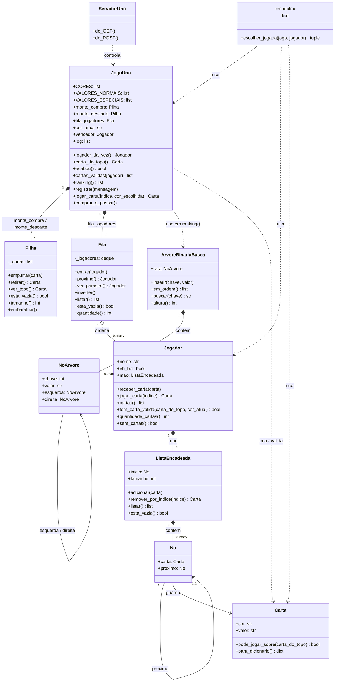
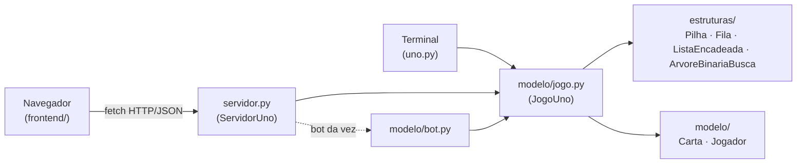

# Diagrama de Arquitetura

## Resumo dos Componentes

| Grupo | Componentes |
|---|---|
| Estruturas de dados | `Pilha`, `Fila`, `No` + `ListaEncadeada`, `NoArvore` + `ArvoreBinariaBusca` |
| Modelo / domínio | `Carta`, `Jogador`, `JogoUno`, módulo `bot` |
| Interfaces | `uno.py` (terminal), `ServidorUno` + funções de ação (web), `frontend/script.js` |

## Relações Principais

| Origem | Relação | Destino | Observação |
|---|---|---|---|
| `JogoUno` | composição | `Pilha` | dois atributos: `monte_compra` e `monte_descarte` |
| `JogoUno` | composição | `Fila` | atributo `fila_jogadores` |
| `JogoUno` | uso | `ArvoreBinariaBusca` | criada e descartada dentro de `ranking()`, não é atributo persistente |
| `JogoUno` | uso | `Carta` | cria as 108 cartas do baralho e cartas de referência para validação |
| `Fila` | agregação | `Jogador` | jogadores existem fora da fila; a fila só os ordena |
| `Jogador` | composição | `ListaEncadeada` | atributo `mao`, exclusivo de cada jogador |
| `ListaEncadeada` | composição | `No` | cadeia de nós |
| `No` | uso | `Carta` | cada nó guarda uma carta |
| `ArvoreBinariaBusca` | composição | `NoArvore` | árvore de nós |
| `NoArvore` | composição | `NoArvore` | `esquerda` e `direita` |
| `bot` | uso | `JogoUno`, `Jogador`, `Carta` | módulo de funções, sem estado próprio |
| `ServidorUno` | uso | `JogoUno`, `Jogador` | cria e consulta a partida em memória |
| `frontend/script.js` | uso (via HTTP/JSON) | `servidor.py` | não há relação de código direta, apenas chamadas `fetch` |

## Diagrama de Classes

## Fluxo de Requisição (Navegador → Motor)

## Links Relacionados

- [Mapa de Componentes](../componentes/README.md)
- [Estrutura de Pastas](estrutura-de-pastas.md)
- [Regras de Negócio](../regras/regras-de-negocio.md)
